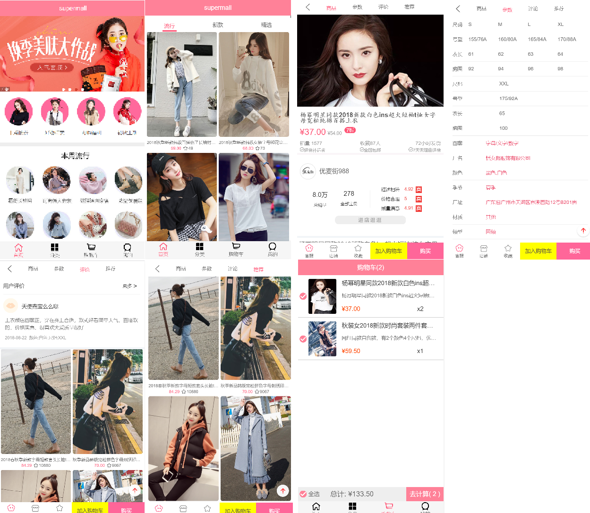

# supermarket
```
本项目实践在coderwhy老师代领下完成,B站上有视频教程。
接口数据来源于服务器，且数据接口实时更换，由于数据接口不对外开放，本项目数据接口为虚拟接口，真实数据接口获取可添加coderwhy老师微信：coderwhy001。
```

## Project setup
```
npm install
```

### Compiles and hot-reloads for development
```
npm run serve
```

### Compiles and minifies for production
```
npm run build
```

### Customize configuration
See [Configuration Reference](https://cli.vuejs.org/config/).
